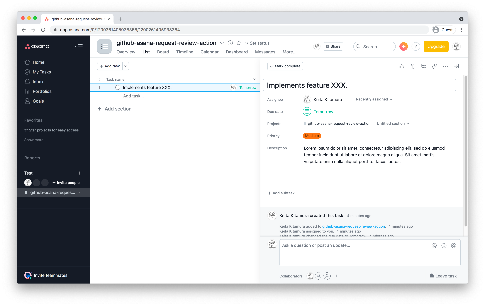
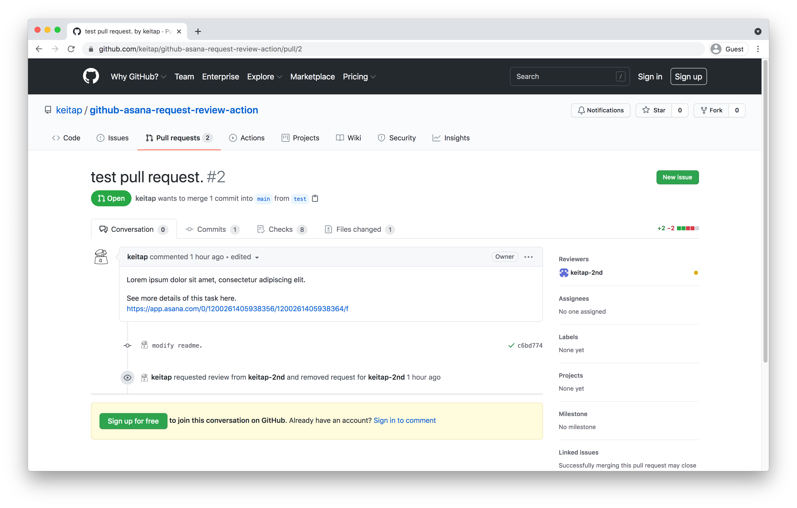
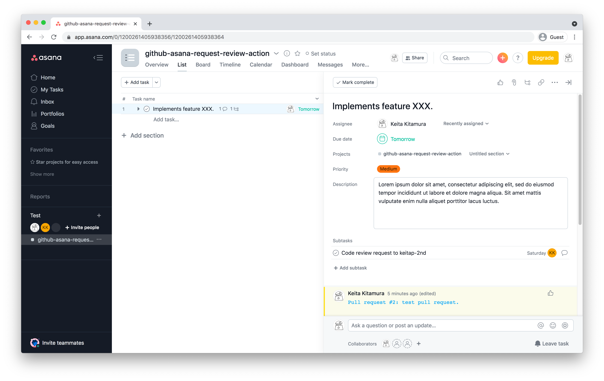
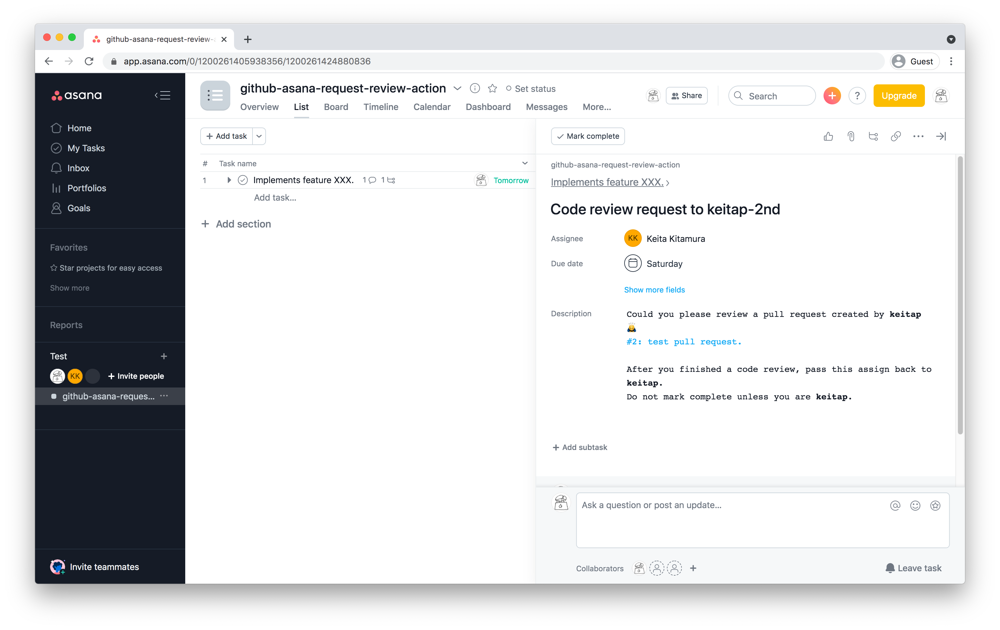

# GitHub Asana Request Review Action

[](https://github.com/keitap/github-asana-request-review-action/actions/workflows/test.yml)

This GitHub Action integrates your GitHub pull requests with Asana. When a reviewer is assigned to a pull request, this action creates a corresponding code review subtask in an Asana task. The Asana task is specified in the pull request description.

## Features

- **Automatic Subtask Creation**: Creates an Asana subtask for code reviews when a reviewer is assigned on GitHub.
- **User Mapping**: Maps GitHub users to Asana users.
- **Task Updates**: Keeps the Asana task updated with the pull request status, including a link to the PR, changed file counts, and labels.
- **Business Day Calculation**: Sets a due date for the review subtask, skipping weekends and holidays.

## Workflow

1.  **Create an Asana Task**: Before creating a pull request, you should have an Asana task for the feature or bug fix.

    

2.  **Create a Pull Request**: When you create a pull request on GitHub, paste the URL of the Asana task into the pull request description.

    

3.  **Assign a Reviewer**: Assign one or more reviewers to the pull request.

4.  **Subtask Created in Asana**: The action will automatically create a subtask in the Asana task for each reviewer. The subtask will be assigned to the corresponding Asana user and will contain details about the pull request.

    
    

## Usage

To use this action in your workflow, you need to add a step to your workflow file (e.g., `.github/workflows/main.yml`).

### Inputs

-   `config_path` (optional): The path to the configuration file. Defaults to `.github/github-asana-request-review.yml`.

### Secrets

-   `ASANA_TOKEN`: Your Asana Personal Access Token.
-   `GITHUB_TOKEN`: The default GitHub token provided by GitHub Actions.

### Example Workflow

```yaml
name: Asana Integration

on:
  pull_request:
    types:
      - opened
      - edited
      - synchronize
      - review_requested
      - review_request_removed
      - labeled
      - unlabeled
  pull_request_review:
    types:
      - submitted

jobs:
  asana-integration:
    runs-on: ubuntu-latest
    steps:
      - name: GitHub Asana Request Review Action
        uses: keitap/github-asana-request-review-action@v1
        with:
          config_path: '.github/github-asana-request-review.yml'
        env:
          ASANA_TOKEN: ${{ secrets.ASANA_TOKEN }}
          GITHUB_TOKEN: ${{ secrets.GITHUB_TOKEN }}
```

## Configuration File

The action is configured via a YAML file. By default, it looks for `.github/github-asana-request-review.yml`.

Here is an example of the configuration file:

```yaml
# Number of business days until the review is due.
due_date: 1

# A list of holidays to exclude from due date calculations.
# Format is YYYY-MM-DD.
holidays:
  "2024-01-01": true
  "2024-12-25": true

# Mapping of GitHub usernames to Asana User GIDs.
# You can get the GID of an Asana user from the Asana API or by looking at the URL in Asana.
accounts:
  github-username1: "1234567890123456"
  github-username2: "2345678901234567"
```

### Configuration Options

-   `due_date` (integer): The number of business days to add to the current date to set the due date for the review subtask. Defaults to `1`.
-   `holidays` (map): A map of dates in `YYYY-MM-DD` format to `true`. These dates will be excluded when calculating the due date.
-   `accounts` (map): A map where the keys are GitHub usernames and the values are the corresponding Asana User GIDs. This is used to assign the subtask to the correct user in Asana.

## Contributing

Contributions are welcome! If you find a bug or have a feature request, please open an issue. If you want to contribute code, please open a pull request.

For more details on the project architecture and development, please see the [DeepWiki page](https://deepwiki.com/keitap/github-asana-request-review-action).

To build the action locally, you will need Go installed. You can run the tests with `make test`.

## License

This project is licensed under the [MIT License](LICENSE).

---

_This README was generated by Jules, a generative AI bot from Google._
